# Toverlight's Engines & Games Exploration Collection

Here's my repo storing all the game engines and games (both pure-code and editor-made) I've ever made since my freshman year.

## Game Demos

Two experimental demos (bundled in a proj, source code: [Dev_Games/world-simulator](Dev_Games/world-simulator)) using *Godot* Engine:

### Boids

A simple demo simulating *Boids* effect, applying to small fishes.

From the video, you can see small fishes developping complex behaviours.

<video src="https://github.com/user-attachments/assets/8ca6e1f3-fc8a-4224-8ed2-9c3a964540ea" width="600" controls></video>

The algorithm is composed of three basic elements:

1. Separation
2. Alignment
3. Cohesion

It's very these make the fishes magically emerge the "beyond-dead-code" behaviours. The arguments were carefully fine-tuned by me, so that the fishes wouldn't attract too close or repulse too far.

### Terrain & Erosion

A simple demo simulating Terrain generation and water erosion, forming a square world map.

From the video, you can see a large generated world terrain pixel map that somewhat resembles reality. The panel HUD shows the conditions considered in the simulation (some of them hasn't been applied yet).

<video src="https://github.com/user-attachments/assets/ce18e648-dcf0-4071-a893-1a2bc15d3b07" width="600" controls></video>

The simulation contains two parts: *terrain* and *erosion*.

The *terrain* was generated by a popular noise algorithm ── *Perlin Noise*, with a randomly set seed. Then it was applied with several octave versions and a linear factor function that from 1.0 in the center to a low value at the corners, in order to form a sea-surrounded circumstance and more details on the edges.

The *erosion* happened each time I pressed R button down. It generates a large number of water "drips" in the different random locations of the map. Every drip flows down the terrain "stairs", bringing soil ── terrain height, and affecting humidity of the flow path. Eventually, it meets the sea, or lake, wherever pixels indicating that's a (blue) water, terminates its path, and pile the soil "height" at the end.

The diverse ecos were just determined by those conditions, and with the help of GPU rendering, the shading process has been accelarated apparently.

### Other Experiments

An early experiment about *Perlin Noise*: 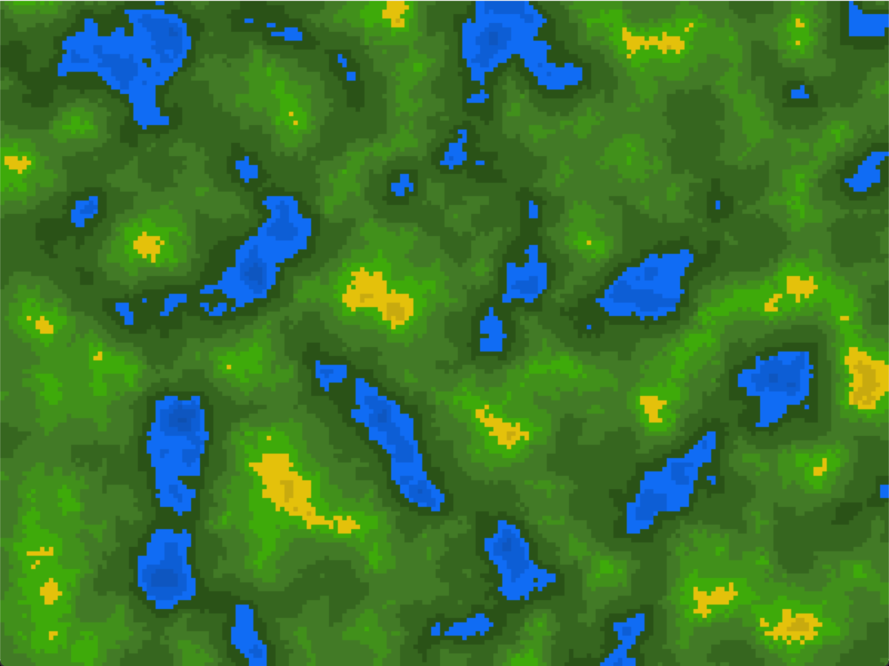

My minecraft mod: 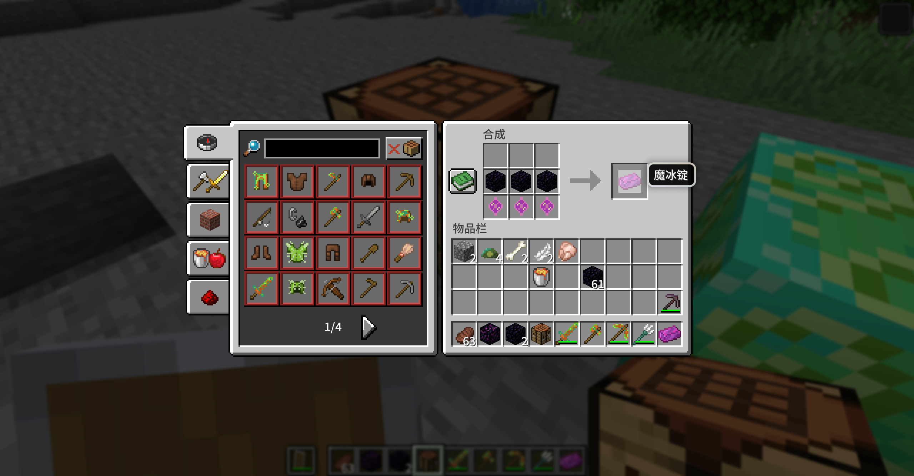

### Other Games

**Games** are as follows, with folder links and previews:

- [ManRequires100s](Dev_Games/ManRequires100s): 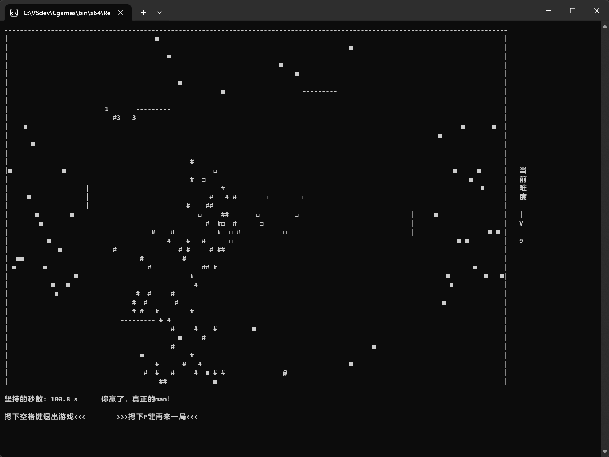
- [SweepBomb](Dev_Games/SweepBomb): 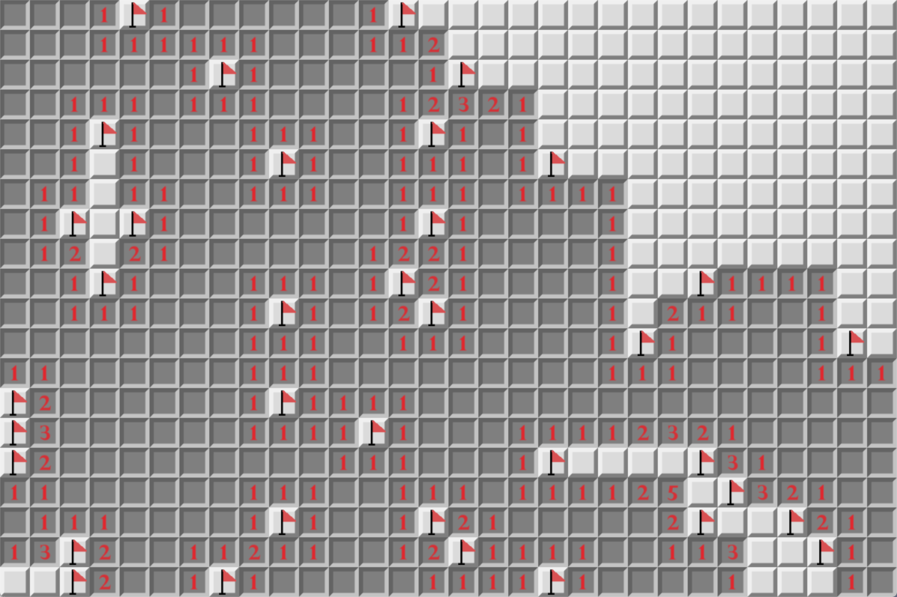
- [BombHall](Dev_Games/BombHall): 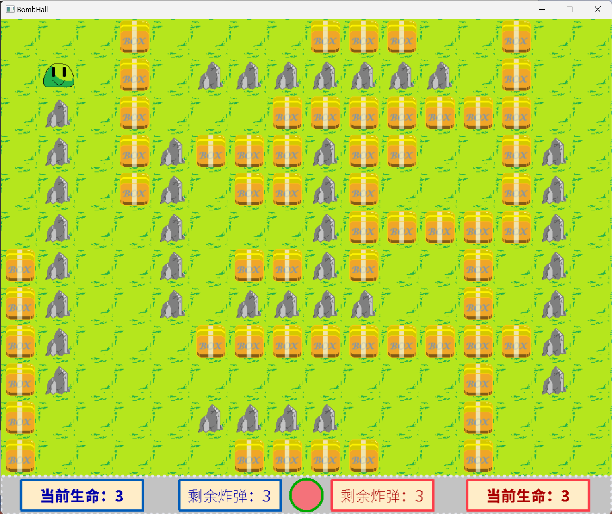
- [植物明星大乱斗 *(following-tutorial)*](Dev_Games/植物明星大乱斗)
- [Flyaway](Dev_Games/Flyaway): 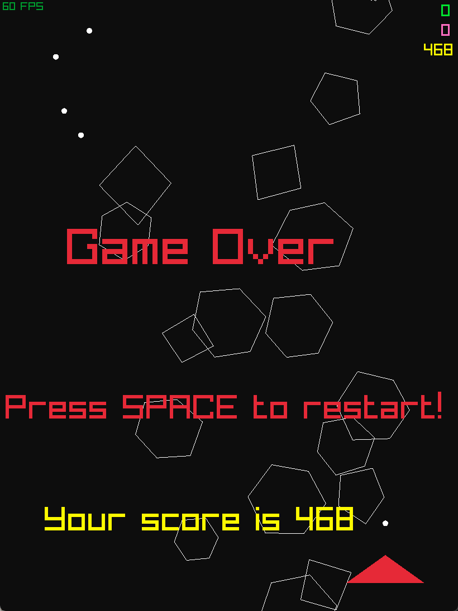
- [GhostEscape *(following-tutorial)*](Dev_Games/GhostEscape): 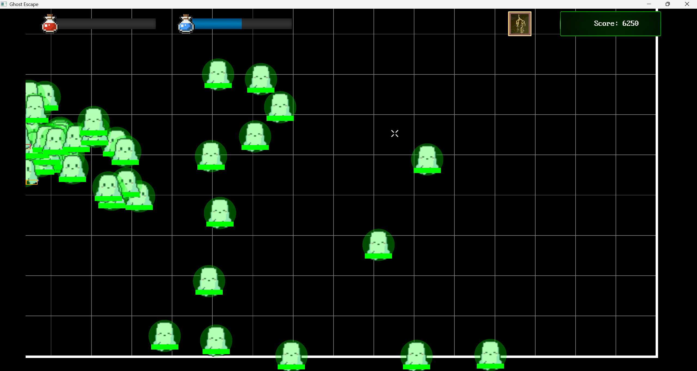
- [MapleCraft](Dev_Games/bevy-maple-craft): 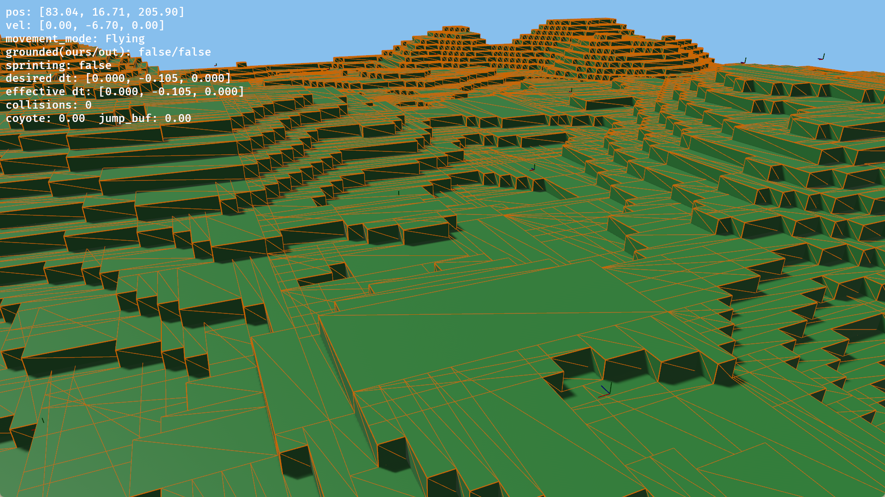

See also: [dev_games](Dev_Games/README.md) (TODO organizing now...)

## Game Engines

*The past five **game engines** I've made are all semi-finished.*

---

My first game engine was written in C++, see folder here: [2dRPG](Game_Engines/2dRPG)

**Effect:** 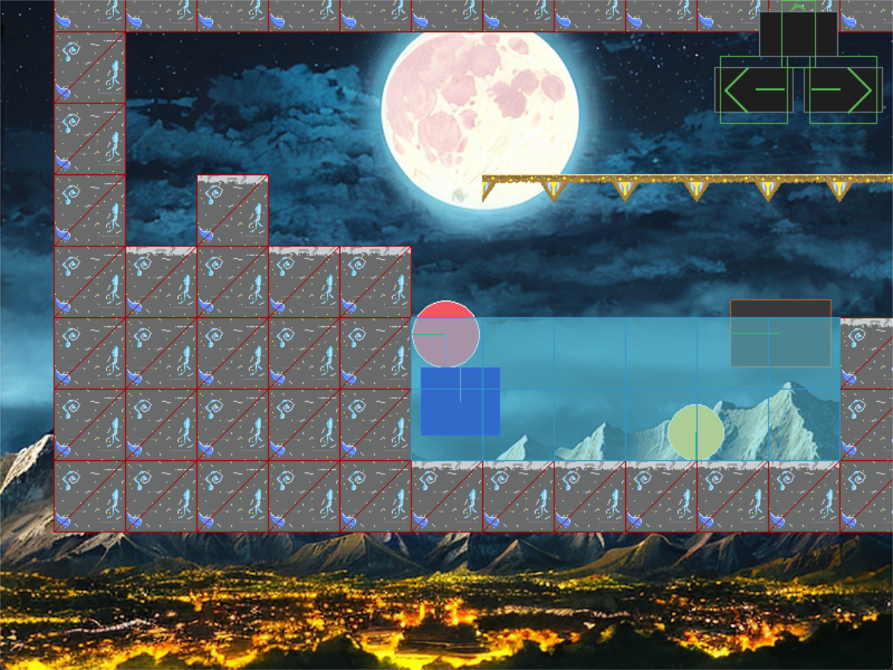

---

The second generation was written in Java, see folder here: [RPG_Test](Game_Engines/RPG_Test)

---

The third generation was written in Java, see folder here: [EngineEditor](Game_Engines/EngineEditor)

**Effect:** 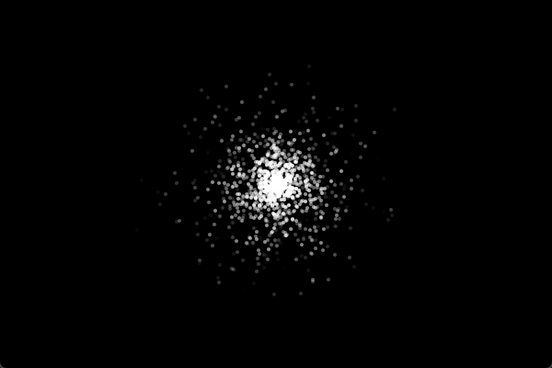 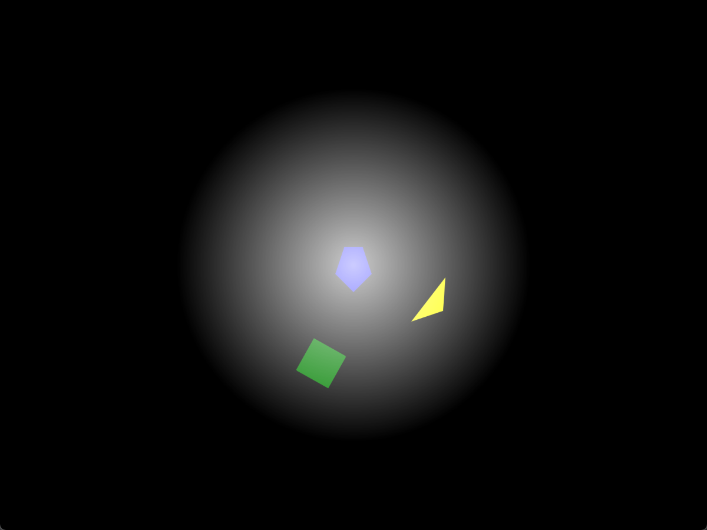

---

The fourth generation was written in C++17, see repo here: [SkyEngine/LazyEngine](https://github.com/Toverlight/sky-engine)

**Effect:** 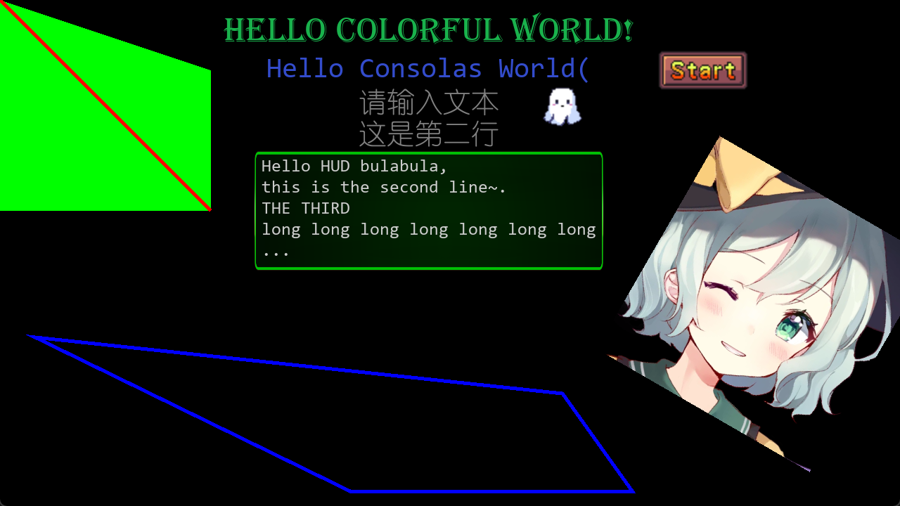 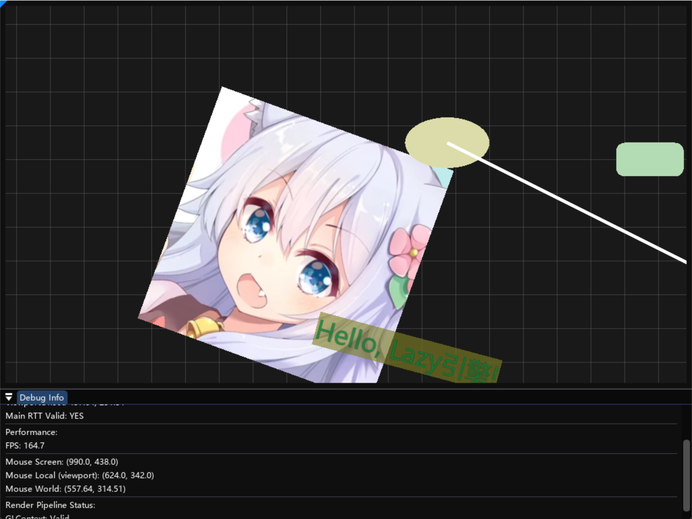

---

The fifth generation was written in C++20, see repo here: [(outdated version) MapleLeaf](https://github.com/Toverlight/old-maple-leaf)

**Effect:** 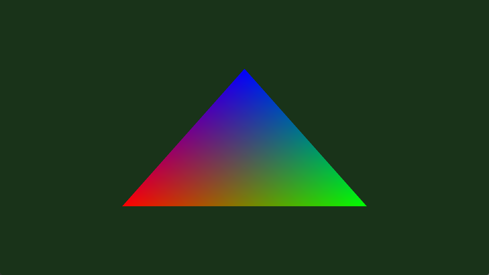

---

See also: [engines](Game_Engines/README.md) (TODO organizing now...)
